# Prompt Engineering for Beginners – 8-Day Practical Learning Program

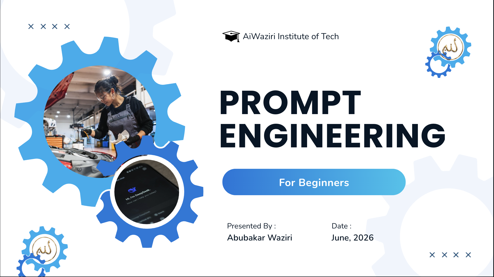

## Overview

This repository contains training materials, practical exercises, screenshots, and resources for the **Prompt Engineering for Beginners – 8-Day Practical Learning Program**.

Prompt Engineering is the practice of designing and optimizing instructions for Artificial Intelligence systems to achieve accurate, reliable, and high-quality outputs. This program introduces the fundamental concepts, techniques, and practical applications of prompt engineering using modern AI tools.

---

## Learning Objectives

By the end of this program, participants will be able to:

- Understand the fundamentals of Prompt Engineering.
- Explain how Large Language Models (LLMs) process prompts.
- Apply various prompting techniques effectively.
- Design prompts for content generation, coding, and research tasks.
- Build simple AI-powered workflows.
- Evaluate and improve prompt performance.
- Explore career opportunities in AI and Prompt Engineering.

---

# Table of Contents

1. Introduction to Prompt Engineering
2. Foundations of Artificial Intelligence
3. Understanding Prompt Engineering
4. Large Language Models (LLMs)
5. Core Prompt Engineering Concepts
6. Designing Effective Prompts
7. Prompting Techniques
8. Advanced Prompting Methods
9. Prompt Engineering for Content Creation
10. Prompt Engineering for Software Development
11. Prompt Engineering for Research and Analysis
12. Introduction to Agentic AI
13. Building AI Workflows
14. Prompt Evaluation and Optimization
15. Real-World Applications and Career Opportunities
16. Final Project, Summary, and Discussion

---

# Course Structure

| Day | Topic |
|------|--------|
| Day 1 | Introduction to AI and Prompt Engineering |
| Day 2 | Large Language Models and Core Concepts |
| Day 3 | Designing Effective Prompts |
| Day 4 | Prompting Techniques |
| Day 5 | Advanced Prompting Methods |
| Day 6 | Content Creation, Coding, and Research |
| Day 7 | Agentic AI and AI Workflows |
| Day 8 | Final Project and Career Opportunities |

---

# Module 1: Introduction to Prompt Engineering

## Topics Covered

- Definition of Prompt Engineering
- Importance of Prompt Engineering
- Benefits of Effective Prompting
- Applications Across Industries

### Practical Demonstration

Add screenshots, examples, and exercises here.

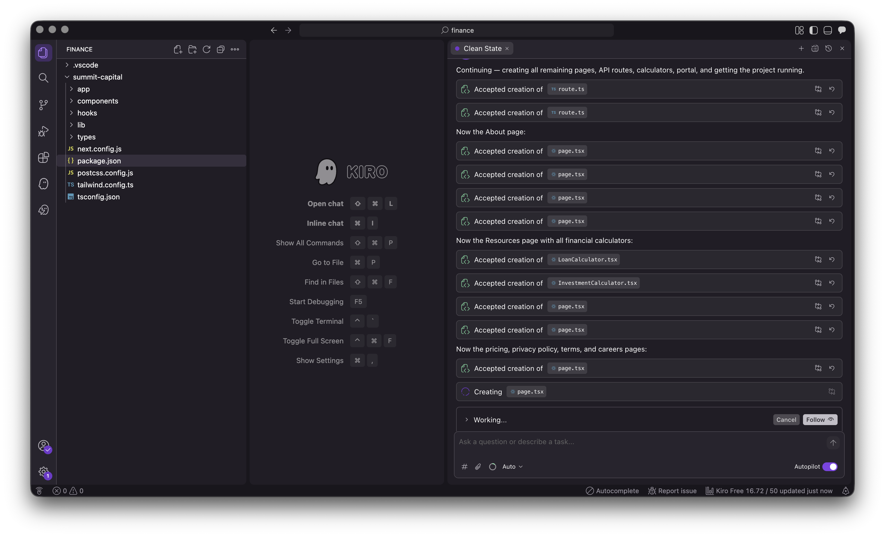

---

# Module 2: Foundations of Artificial Intelligence

## Topics Covered

- Artificial Intelligence Overview
- Machine Learning
- Deep Learning
- Generative AI
- AI Applications

### Practical Demonstration

Add screenshots, examples, and exercises here.

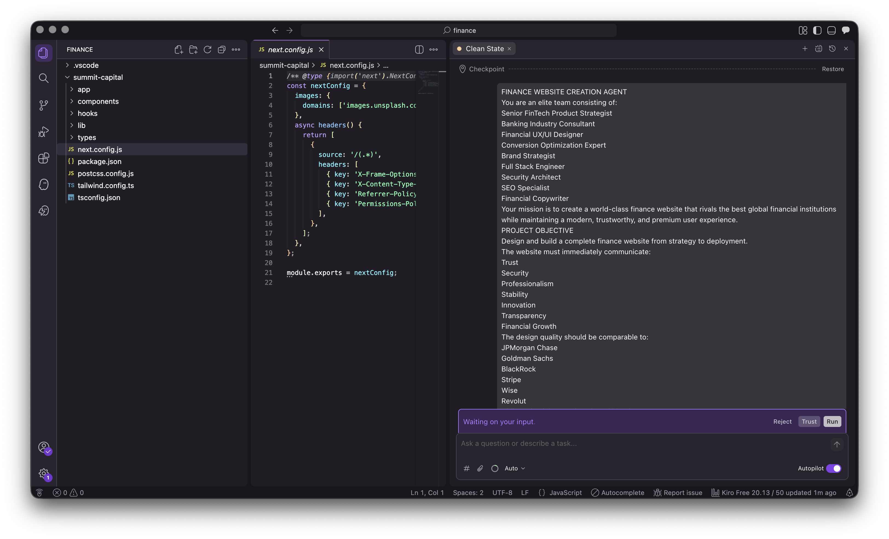

---

# Module 3: Understanding Prompt Engineering

## Topics Covered

- Prompt Fundamentals
- Prompt Design Principles
- Prompt Structures
- Prompt Components

### Practical Demonstration

Add screenshots, examples, and exercises here.

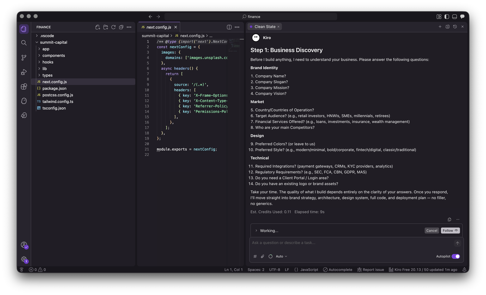

---

# Module 4: Large Language Models (LLMs)

## Topics Covered

- How LLMs Work
- Training Data
- Inference Process
- Limitations of LLMs

### Practical Demonstration

Add screenshots, examples, and exercises here.

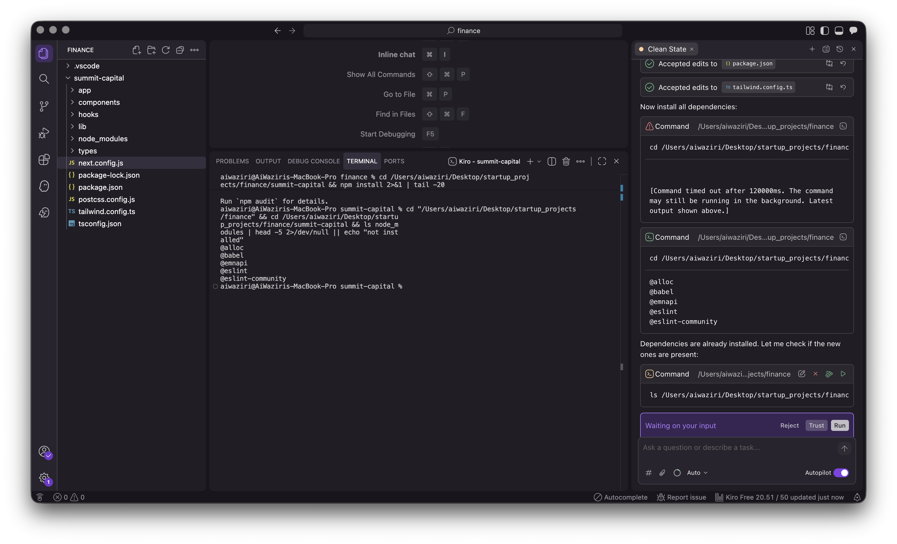

---

# Module 5: Core Prompt Engineering Concepts

## Topics Covered

- Prompts
- Tokens
- Context Windows
- Temperature
- Model Parameters

### Practical Demonstration

Add screenshots, examples, and exercises here.

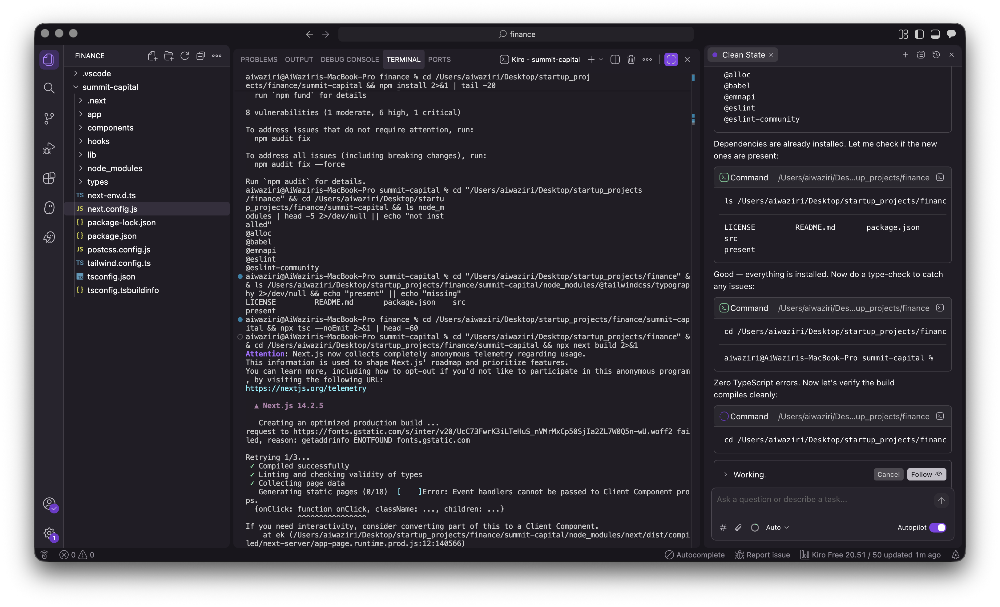

---

# Module 6: Designing Effective Prompts

## Topics Covered

- Role Prompting
- Context Engineering
- Constraints
- Output Formatting
- Best Practices

### Practical Demonstration

Add screenshots, examples, and exercises here.

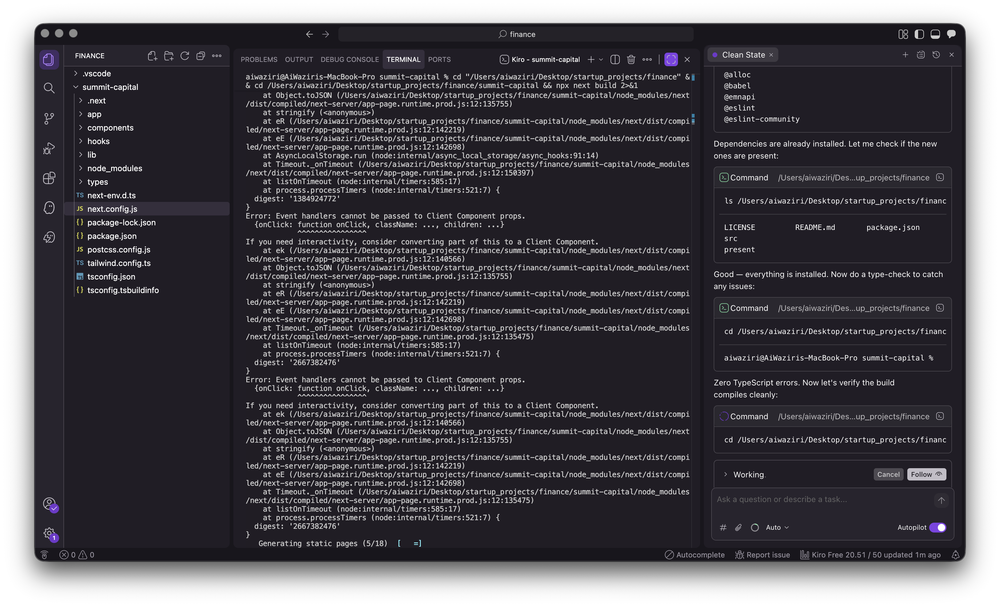

---

# Module 7: Prompting Techniques

## Topics Covered

- Zero-Shot Prompting
- One-Shot Prompting
- Few-Shot Prompting

### Practical Demonstration

Add screenshots, examples, and exercises here.

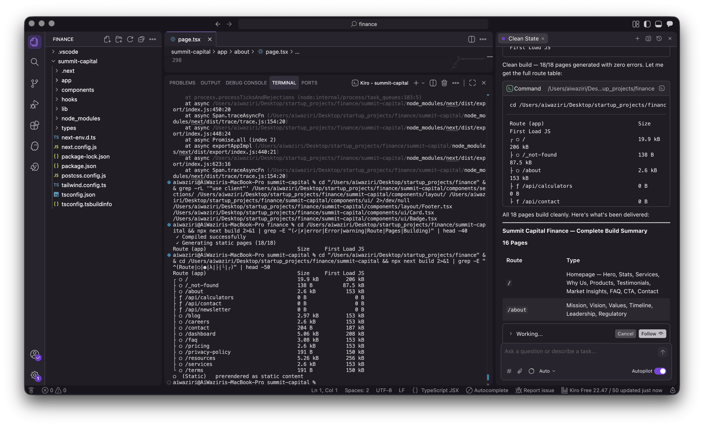

---

# Module 8: Advanced Prompting Methods

## Topics Covered

- Chain-of-Thought Prompting
- Self-Consistency
- Reflection Prompting
- Decomposition Techniques

### Practical Demonstration

Add screenshots, examples, and exercises here.

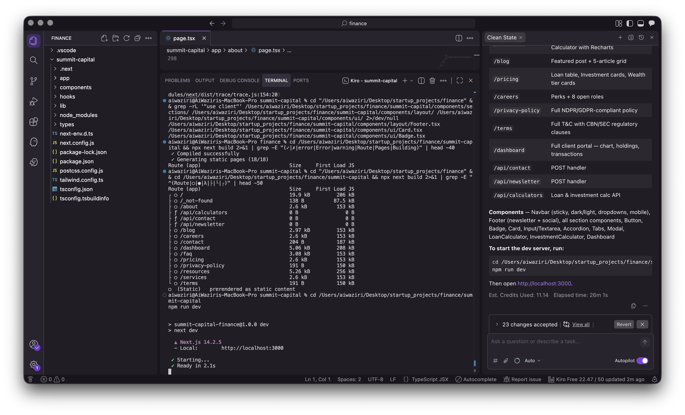

---

# Module 9: Prompt Engineering for Content Creation

## Topics Covered

- Blog Generation
- Report Writing
- Social Media Content
- Marketing Content

### Practical Demonstration

Add screenshots, examples, and exercises here.

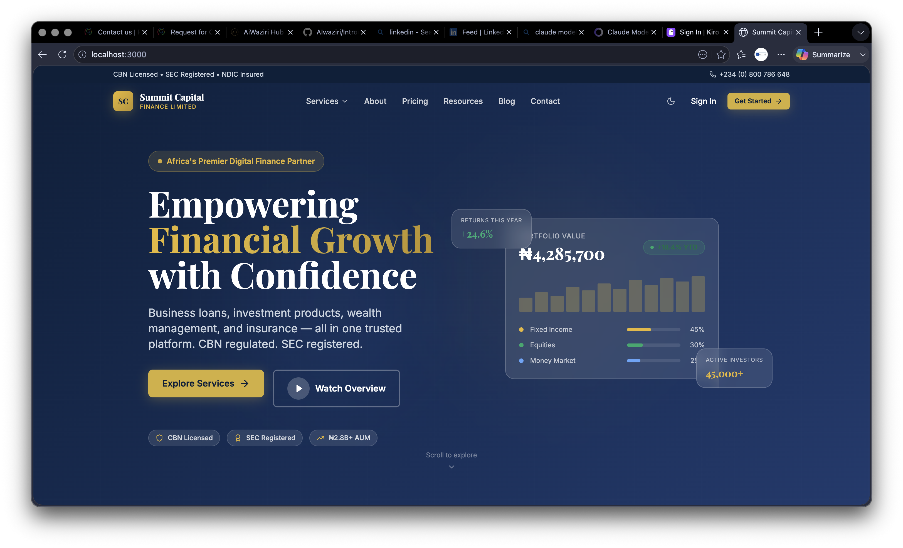

---

# Module 10: Prompt Engineering for Software Development

## Topics Covered

- Code Generation
- Debugging
- Documentation
- Testing
- Refactoring

### Practical Demonstration

Add screenshots, examples, and exercises here.

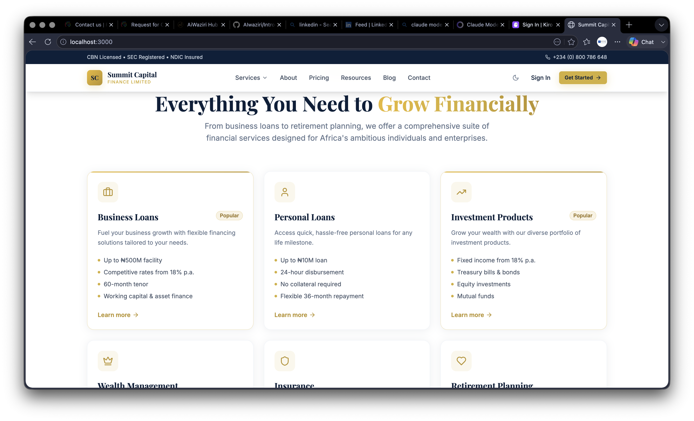

---

# Module 11: Prompt Engineering for Research and Analysis

## Topics Covered

- Research Assistance
- Data Analysis
- Summarization
- Knowledge Extraction

### Practical Demonstration

Add screenshots, examples, and exercises here.


---

# Module 12: Introduction to Agentic AI

## Topics Covered

- AI Agents
- Agent Architectures
- Tool Usage
- Autonomous Systems

### Practical Demonstration

Add screenshots, examples, and exercises here.

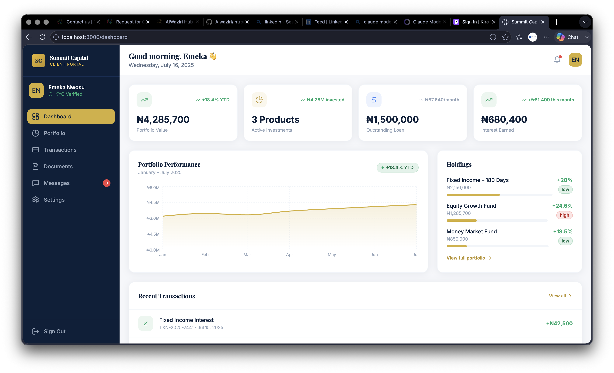

---

# Module 13: Building AI Workflows

## Topics Covered

- Workflow Design
- Task Automation
- Multi-Step Reasoning
- Process Optimization

### Practical Demonstration

Add screenshots, examples, and exercises here.

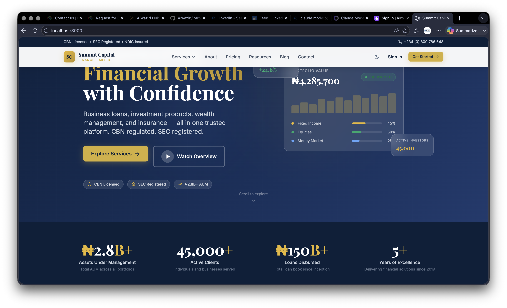

---

# Module 14: Prompt Evaluation and Optimization

## Topics Covered

- Prompt Testing
- Performance Metrics
- Evaluation Methods
- Optimization Strategies

### Practical Demonstration

Add screenshots, examples, and exercises here.

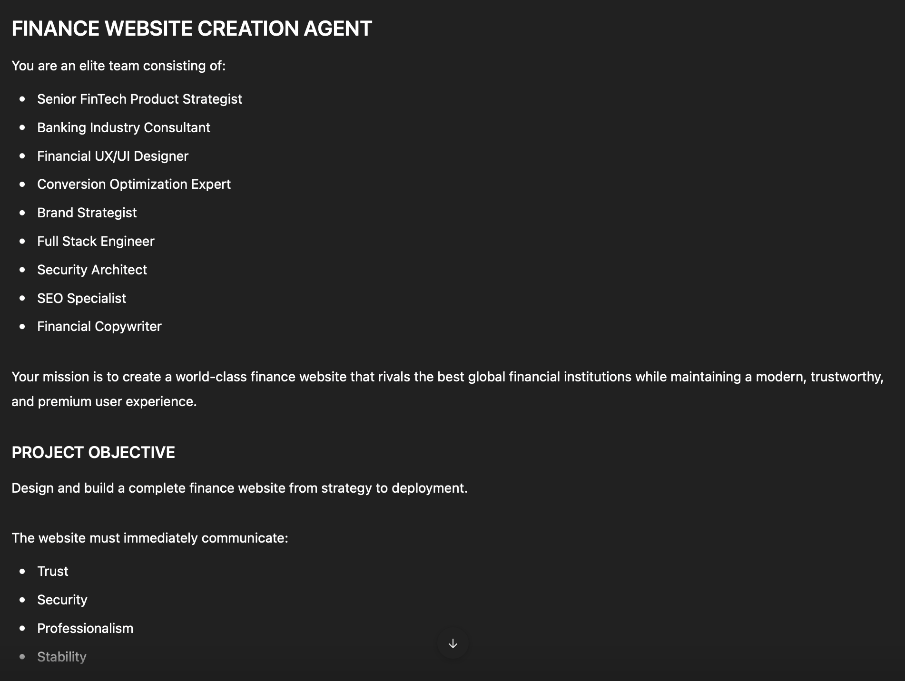

---

# Module 15: Real-World Applications and Career Opportunities

## Applications

- Education
- Healthcare
- Finance
- Legal Services
- Marketing
- Software Development

## Career Paths

- Prompt Engineer
- AI Consultant
- AI Trainer
- LLM Developer
- AI Product Manager
- AI Automation Specialist

### Practical Demonstration

Add screenshots, examples, and exercises here.


---

# Module 16: Final Project, Summary, and Discussion

## Final Project

Participants will:

- Define a real-world problem
- Design prompts
- Test outputs
- Improve performance
- Present findings

## Summary

- Key concepts reviewed
- Lessons learned
- Future learning pathways

### Practical Demonstration

Add screenshots, examples, and exercises here.


---

# Repository Structure

```text
Prompt-Engineering-Beginners/
│
├── README.md
├── slides/
├── exercises/
├── resources/
├── images/
│   ├── module1-example1.png
│   ├── module2-example1.png
│   ├── ...
│   └── module16-example1.png
│
└── project/
```

---

# Recommended Tools

- ChatGPT
- Claude
- Gemini
- GitHub Copilot
- Cursor AI
- Microsoft Copilot

---

# License

This project is provided for educational and learning purposes.

---

## Author

### AIWAZIRI LIMITED

**Transforming Dreams Into Algorithms**

Building Africa's Intelligence Infrastructure.
